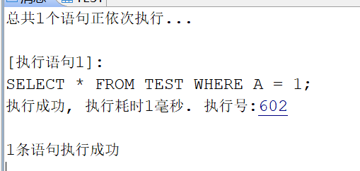
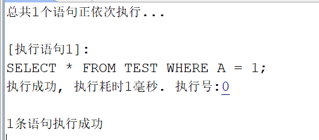
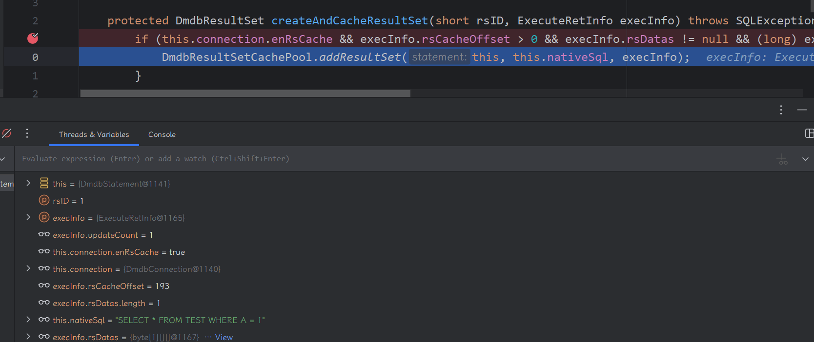
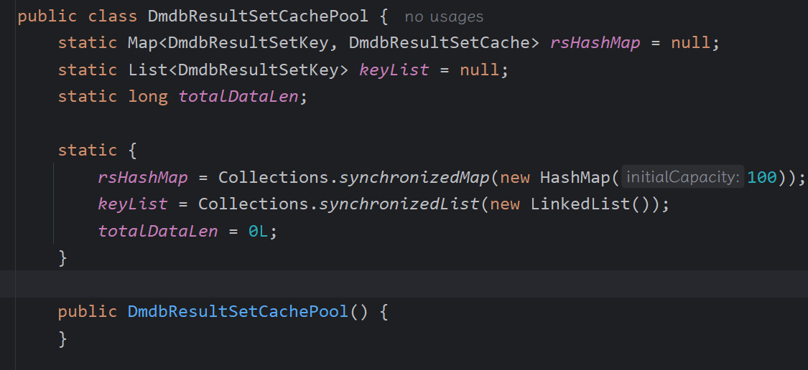
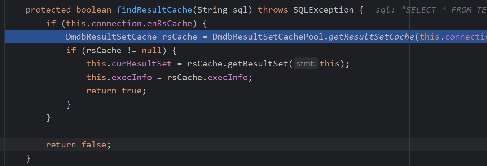

+++
date = '2025-10-23T17:03:53+08:00'
draft = false
title = '数据库缓存'
+++

数据库缓存的作用就是减少 SQL 实际执行次数，只需要返回缓存的结果即可，这样可以减少数据库的压力，提高系统的性能。

达梦数据库缓存支持两种：
1. 服务端缓存；
2. 客户端缓存；

## 服务端缓存

服务端缓存是指应用会接触到数据库层，但是不会执行具体 SQL 语句，而是直接返回缓存的结果。

### 开启方法

我们使以下 SQL 走缓存

```sql
SELECT * FROM TEST WHERE A = 1;
```

准备表结构，插入数据

```sql
CREATE TABLE TEST ( A INT, B VARCHAR(255) );
INSERT INTO TEST VALUES ( 1, 'AA' );
INSERT INTO TEST VALUES ( 2, 'BB' );
COMMIT;
```

在 `dm.ini` 文件中修改以下参数，重启数据库

```ini
RS_CAN_CACHE      = 1
RS_CACHE_TABLES   = TEST
BUILD_FORWARD_RS  = 1
```

此时执行两次准备的 SQL，观察执行号，如果第二次执行号为 0，根据经验说明走了缓存。

第一次执行截图如下


第二次执行截图如下，说明走了缓存


> [!NOTE]
> 如果你观察仔细的话，就会发现，数据库 sqllog 的 `EXEC_ID` 与实际的 `EXEC_ID` 其实并不一致，就比如开启了服务端缓存，实际的 `EXEC_ID` 是 `0`，但是 sqllog 中是 `-1`。
>
> 只能说有点 **太蠢了**，属于是没有整体设计，负责 sqllog 的人和负责 `EXEC_ID` 的人没有沟通。

### 原理解析

讲道理，我也想知道，但是没有资料。

### 注意事项

在以下情况下，服务端不支持结果集缓存：

1. 必须是单纯的查询语句；
2. 查询语句的计划也必须是缓存的；
3. 守护环境中的备库不支持结果集缓存；
4. 查询语句中包含以下任意一项，结果集都不能缓存：
      * 临时表；
      * 包含序列的 CURVAL 或者 NEXTVAL；
      * 包含非确定的 SQL 函数；
      * 包含RAND、SYSDATE 等返回值实时变化的系统函数；
      * 其他一些实时要素；


## 客户端缓存

客户端缓存是在服务端缓存的基础上开启的。

> [!DANGER]
> 虽然我并不知道这两者有什么关系。
>
> 客户端缓存应该直接在驱动层就做了 hashmap 用于缓存了吧，都不会经过数据库，不能理解为什么客户端需要判断服务端是否缓存。

### 开启方法

由于需要服务端也进行缓存，所以咱们沿用服务端缓存的例子，使用 `jdbc` 驱动来开启客户端缓存。

在 `dm.ini` 文件中修改以下参数，重启数据库

```ini
CLT_CACHE_TABLES  = SYSDBA.TEST # 一定要加上模式名
```

代码如下

```java
public class Main {
    public static void main(String[] args) throws SQLException, ClassNotFoundException {
        String jdbcString = "dm.jdbc.driver.DmDriver";
        String urlString = "jdbc:dm://127.0.0.1:5236?ENABLE_RS_CACHE=1";
        String username = "SYSDBA";
        String password = "SYSDBA";
        String sql = "SELECT * FROM TEST WHERE A = 1";

        Class.forName(jdbcString);

        Connection connect = DriverManager.getConnection(urlString, username, password);

        Statement statement = connect.createStatement();
        ResultSet resultSet = statement.executeQuery(sql);
        resultSet.close();
        statement.close();

        Statement statement1 = connect.createStatement();
        ResultSet resultSet1 = statement1.executeQuery(sql);
        resultSet1.close();
        statement1.close();
    }
}
```

> [!NOTE]
> 需要在一个连接里面才可以走结果集缓存。

### 原理解析

`debug` 第一个 `statement` 就可以发现，此时已经把结果集加入到 `DmdbResultSetCachePool` 中了。



此类提供了一个专属的 `Map` 来存放结果集。



并且，在每次创建 `statement` 的时候均会判断是否使用了客户端缓存、是否存在客户端缓存。




### 注意事项

一定要开服务端结果集缓存。
